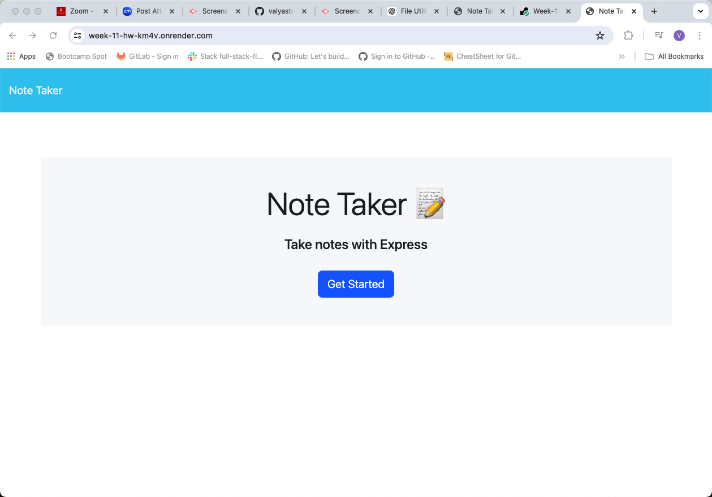
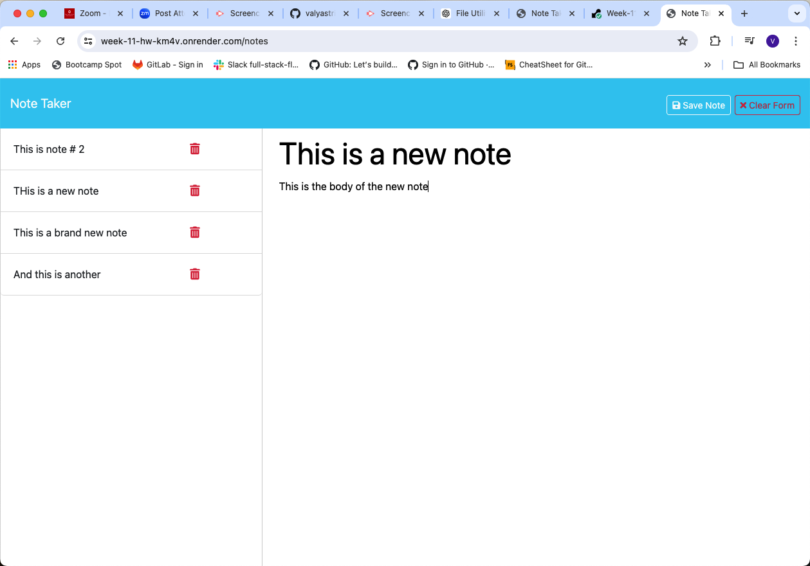

# Note Taker


## Description

Note Taker is an application that allows users to write, save, and delete notes. This application uses an Express.js back end and saves and retrieves note data from a JSON file.


## Table of Contents

- [Installation](#installation)
- [Usage](#usage)
- [API Routes](#api-routes)
- [Bonus Features](#bonus-features)
- [Deployment](#deployment)
- [Contributing](#contributing)
- [License](#license)


## Installation

To install the necessary dependencies, run the following command:

```sh
npm install
```

## Usage
To start the application, use the following command:

```sh
npm start
```

This will start the server and the application will be accessible at http://localhost:3002.

### Writing and Saving Notes

1. Open the application and click on the link to the notes page.
2. Enter a note title and note text.
3. Click the "Save" button to save the note.
4. The saved note will appear in the left-hand column.

### Viewing Saved Notes

1. Click on a note in the left-hand column to view it.
2. The note will be displayed in the right-hand column.

### Deleting Notes

1. Click the delete icon next to a note in the left-hand column to delete it.


## API Routes

### HTML Routes

- `GET /notes` - Returns the `notes.html` file.
- `GET *` - Returns the `index.html` file.

### API Routes

- `GET /api/notes` - Reads the `db.json` file and returns all saved notes as JSON.
- `POST /api/notes` - Receives a new note to save on the request body, adds it to the `db.json` file, and returns the new note to the client.
- `DELETE /api/notes/:id` - Receives a query parameter containing the id of a note to delete, removes the note with the given id property, and rewrites the notes to the `db.json` file.


## Bonus Features

This application includes a DELETE route to handle note deletions. When a note is deleted, it is removed from the `db.json` file and the updated list of notes is saved.


## Deployment

The application is deployed to Render. You can access the deployed application [here](https://week-11-hw-km4v.onrender.com).


## Screenshots

### Index HTML Page


### Notes HTML Page



## Contributing

Contributions are welcome! If you have suggestions or improvements, please create a pull request or open an issue to discuss them.


